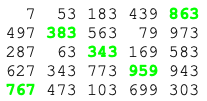
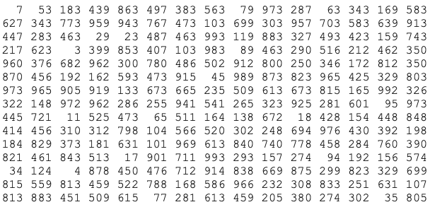

## **[345. Matrix Sum](https://projecteuler.net/problem=345)**

### Question
We define the Matrix Sum of a matrix as the maximum possible sum of matrix elements such that 
none of the selected elements share the same row or column.

For example, the Matrix Sum of the matrix below equals 3315 ( = 863 + 383 + 343 + 959 + 767):



Find the Matrix Sum of:



### Solution

I first came up with the slow solution. What's the time complexity for this? 

It wasn't trivial at the beginning until I started to draw the **recursive graph**. It became clear that the recursion is equivalent to 
the fast dp solution, with a complexity of ) where , which is better than )

```python
m = [[int(y) for y in x.split()] for x in s.split('\n')]
n = len(m)
```

#### Brute force (~forever) 
```python
from itertools import permutations

ans = 0
for p in permutations(range(n)):
    t = sum(m[row][col] for row, col in enumerate(p))
    ans = max(ans, t)
print(ans)
```

#### Slow (~3.5s)

```python
from typing import Tuple

def p345():
    def f(row: int, state: int, cur_sum: int):
        if state in d and d[state] > cur_sum:
            return

        d[state] = cur_sum

        for col in range(n):
            if state & (1 << col) == 0:
                new_state = state | (1 << col)
                f(row + 1, new_state, cur_sum + m[row][col])

    d = {}
    f(0, 0, 0)
    return d[(1 << n) - 1]
```

#### Fast (~0.25s)

```python
def p345_dp():
    d = [0 for i in range(1 << n)]
    previous_states = [0]
    for row in range(n):
        new_states = set()
        # len(previous_states) is equal to comb(n, row)
        for state in previous_states:
            for col in range(n):
                if state & (1 << col) == 0:
                    new_state = state | (1 << col)
                    new_states.add(new_state)
                    d[new_state] = max(d[new_state], d[state] + m[row][col])
        previous_states = new_states
    return d[-1]
```

### Answer 
`13938`

### Bonus 
```python
from scipy.optimize import linear_sum_assignment

rows, cols = linear_sum_assignment(m, maximize=True)
ans = sum(m[r][c] for r, c in zip(rows, cols))
print(ans)
```

