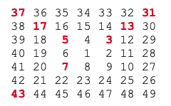

## **[58. Spiral primes](https://projecteuler.net/problem=58)**

### Question
Starting with 1 and spiralling anticlockwise in the following way, a square spiral with side length 7 is formed.



It is interesting to note that the odd squares lie along the bottom right diagonal, but what is more interesting is that 8 out of the 13 numbers lying along both diagonals are prime; that is, a ratio of 8/13 ≈ 62%.

If one complete new layer is wrapped around the spiral above, a square spiral with side length 9 will be formed. If this process is continued, what is the side length of the square spiral for which the ratio of primes along both diagonals first falls below 10%?

### Solution
Not sure if this is a good solution as it takes about 5 seconds to get the answer. Usually it should be fractions of a second for a
5%-difficulty-level question. [**Follow-up**](https://github.com/doudou-h/doudou-h.github.io/blob/main/project-euler-solution/58.%20Spiral%20primes%20II.md)

```python
def p58(N = 0.1):
    n, prime_cnt, percentage = 1, 0, 1.0
    while percentage >= N:
        n += 2
        for k in range(4):
            if isprime(n * n - k * (n - 1)):  # isprime function see link below
                prime_cnt += 1
        percentage = prime_cnt / (2 * n - 1)
    return n
```

### Answer 
`26241`

### Note
- [isprime](https://github.com/doudou-h/doudou-h.github.io/blob/main/project-euler-solution/7.%2010001st%20prime.md)
