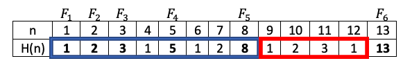

## **[692. Siegbert and Jo](https://projecteuler.net/problem=692)**

### Question
Siegbert and Jo take turns playing a game with a heap of N pebbles:

1. Siegbert is the first to take some pebbles. He can take as many pebbles as he wants. (Between 1 and N inclusive.)
2. In each of the following turns the current player must take at least one pebble and at most twice the amount of pebbles taken by the previous player.
3. The player who takes the last pebble wins.

Although Siegbert can always win by taking all the pebbles on his first turn, to make the game more interesting he chooses to take the smallest number of pebbles that guarantees he will still win (assuming both Siegbert and Jo play optimally for the rest of the game).

Let H(N) be that minimal amount for a heap of N pebbles. H(1)=1, H(4)=1, H(17)=1, H(8)=8, H(18)=5.

Let G(n) be ∑H(k), k=1,...,n. G(13)=43. Find G(23416728348467685).

### Solution



Let  be i-th Fibonacci number:

=G(F_{i-1})&plus;G(F_{i-2})-F_{i-2}&plus;F_i)

```python
def p692(N=23416728348467685):
    Fm2, Fm1 = 1, 2
    Gm2, Gm1 = 1, 3
    F, G = None, None
    while not F or F < N:
        F = Fm2 + Fm1
        G = Gm1 + Gm2 - Fm2 + F

        Fm2, Fm1 = Fm1, F
        Gm2, Gm1 = Gm1, G
    return G
```

### Answer
`842043391019219959`
