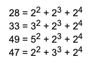

## **[87. Prime power triples](https://projecteuler.net/problem=87)**

### Question
The smallest number expressible as the sum of a prime square, prime cube, and prime fourth power is 28. In fact, there are exactly four numbers below fifty that can be expressed in such a way:



How many numbers below fifty million can be expressed as the sum of a prime square, prime cube, and prime fourth power?

### Solution

```python
def p87(N=50000000):
    M = int(sqrt(N - 2 ** 3 - 2 ** 4))
    primes = sieve(M)  # sieve function see link below

    s, L = set(), len(primes)
    for i in range(L):
        for j in range(L):
            if primes[i] ** 2 + primes[j] ** 3 >= N: break
            for k in range(L):
                n = primes[i] ** 2 + primes[j] ** 3 + primes[k] ** 4
                if n >= N: break
                s.add(n)
    return len(s)
```

### Answer 
`1097343`

### Note
- [sieve](./10.%20Summation%20of%20primes.md)
